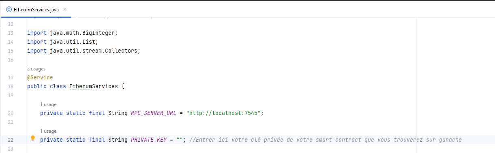
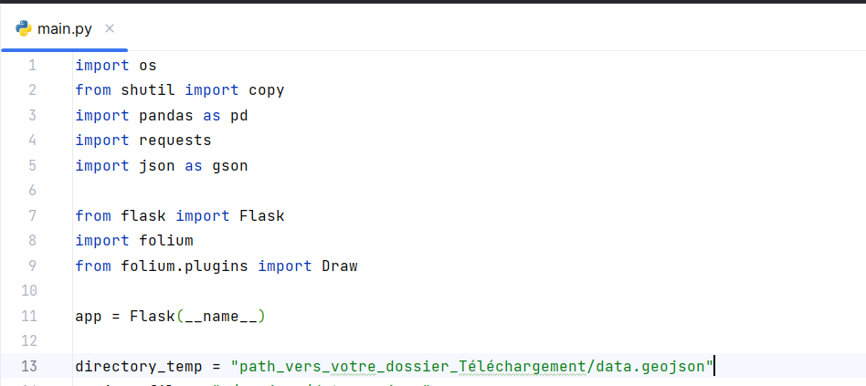
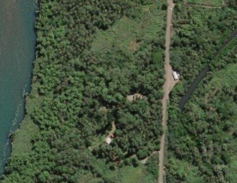
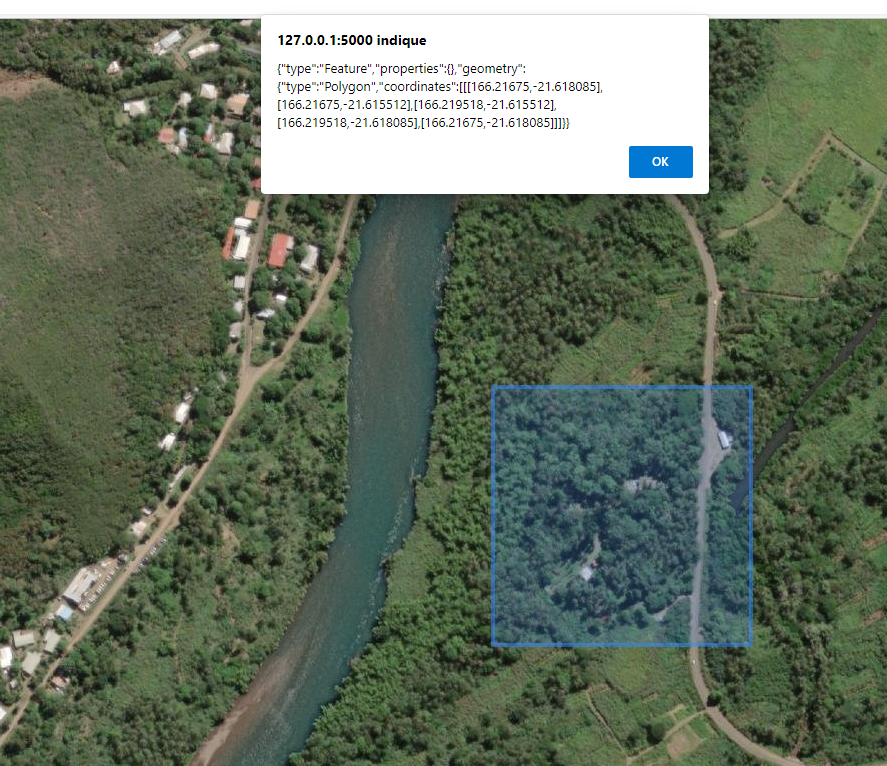
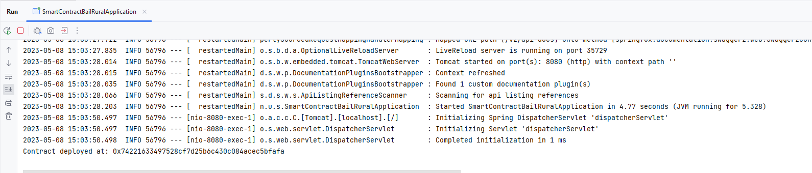
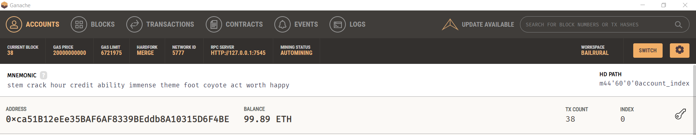
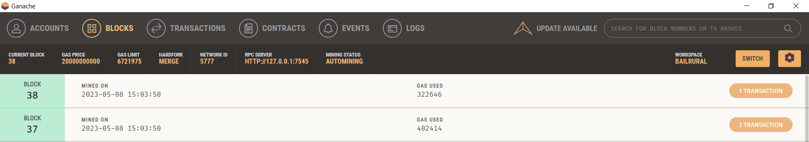
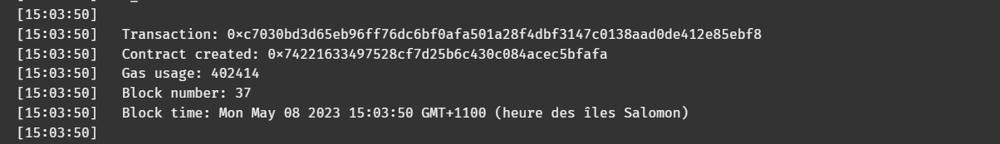
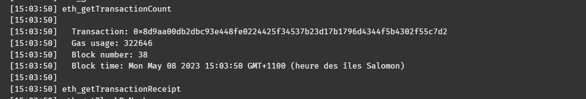

# ProjetEISI
Projet du cours élasticité et interopérabilité des système d'information

## Projet :
Pour se projet, il nous a été demandé un application qui crée des _smart contract_. Les _smart contract_ représente des _baux ruraux_, un bail rural est composer du nom du propriétaire du terrain, la surface en ares ainsi que les points gps qui limite le terrain.

## Applicatif :
l'application se divise en un client python avec le framework Flask et la librairie folium pour l'affichage de la carte et le relever des points gps. Le back est une application SpringBoot qui se connecte au server Ganache pour générer un _smart contract_. La dernière partie est le _smart contract_ pour la blockchaîne Ethereum.

Pour réaliser cette application nous avons utiliser la librairie _web3j_ et son CLI (_web3j_cli_) ainsi que le compilateur _sol_c_ que vous trouverez dans le dépôt GIT sous le dossier 
> web3j-3.6.0

## Installation :

1. Application python : 
Vous aurez premièrement besoin du framework _Flask_ et des librairies suivantes : folium, pandas, requests.

    Installation du framwork Flask : 

    > pip install Flask

    Installation de la librairie folium : 

    > pip install folium

    Installation de la librairie pandas : 

    > pip install pandas

    Installation de la librairie requests : 

    >pip install request

2. Application Java : 
    premièrement il faut générer la classe java qui va correspondre au smart contract défini dans le fichier.sol. Pour réaliser cette opération il vous faudra ouvrir votre terminal à partir du dossier ou vous avez mis votre fichier solc-windows.exe et entrer cette ligne de commande en l'adaptant : 

    > solc-windows.exe <a>file_name.sol</a> --bin --abi --optimize -o <a>out_dir</a>

    Une fois cette opération finie vous devriez avoir deux fichier dans votre dossier de sortie <a>out_dir</a>. Un fichier <a>file_name.bin</a> et un autre fichier <a>file_name.abi</a>

    Finalement l'opération qui vous gérèrera la classe <a>file_name</a> grace au cli web3j. Ouvrer un terminal a partir du fichier <a>/bin</a> et entrer la commande suivante : 

    > web3j generate solidity -a <a>./path/filename.abi</a> -b <a>./path/filename.bin</a> -o <a>/path/to/yourSrc/main/java</a> -p <a>package.name</a>
    Une fois toutes les opération précédente réaliser votre application est prête à intéragir avec Ganache

Pour adapter mon code a votre environnement vous aurez aussi besoin de faire des changement au niveau du code Java et Python.

Au niveau de Java :

Vous devrez placez la clé privé que vous trouverez sous Ganache.

Au niveau du Pyhton :

## Amélioration :
Nous n'avons pas eu le temps développer un petit formulaire pour permettre a l'utilisateur de renseigner le nom du propriétaire et la surface du terrain.

## Fonctionnement :

L'application python nous permet d'avoir une page web qui est centrée sur la Nouvelle-Calédonie et plus particulièrement sur la commune de Thio.

Nous avons choisi arbitrairement cette propiété :

Nous réalisons un tracer :

Après avoir appuyer sur le bouton export nous enregistrons la transaction :

Du côté de Ganache, nous retrouvons cette enregistrement :

au niveau des Blocks :

l'enregistrement au niveau des transactions :

Et en dernier les logs sur la transaction :

